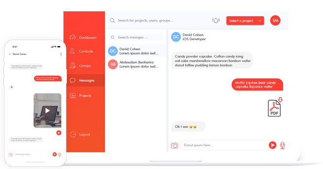

# Peerz app  

> Projet Swift permettant la communication entre devices à proximité en utilisant le framework Multipeer Connectivity

## Fonctionnalités

1. Envoi de messages, images
2. Envoi de notes vocales
3. Appel vidéo
4. Personnalisation du thème et nom du device

## Contributeurs

* [Samuel Mrejen](https://github.com/SamuelMrejen)
* [David Cohen](https://github.com/DavSCo)
* [Abdessalam BENHARIRA](https://github.com/Abdessalam98)